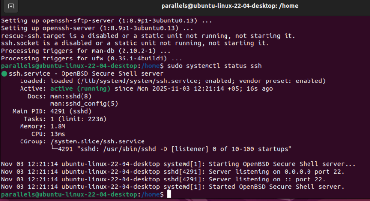
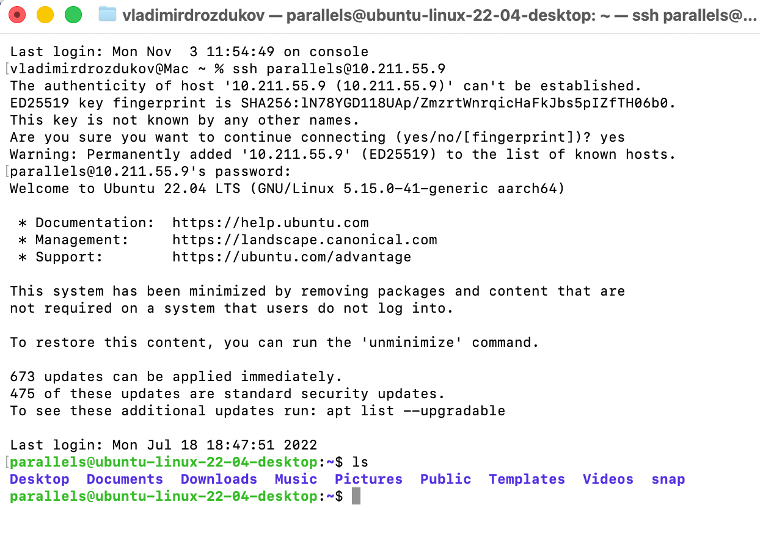
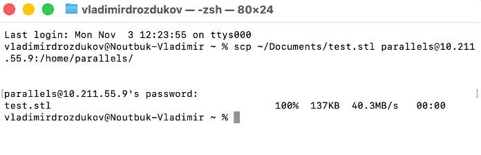
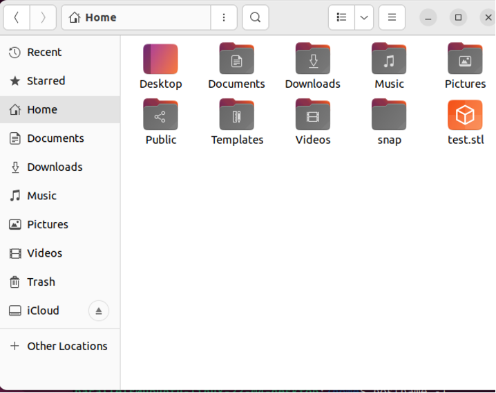
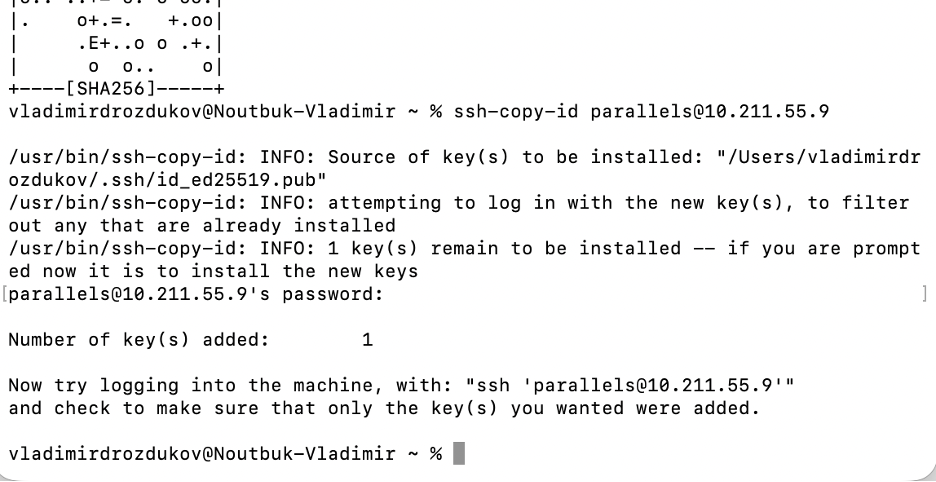

# ssh_practice
## Практика: SSH — кейсы и отчёты

### Кейс 1: Установка и настройка SSH‑сервера

**Отчёт**

---

### Кейс 2: Подключение к удалённому серверу

**Отчёт**

---

### Кейс 3: Копирование файлов с помощью SCP

**Отчёт**

---

### Кейс 4: Работа с ключами SSH

**Отчёт**

